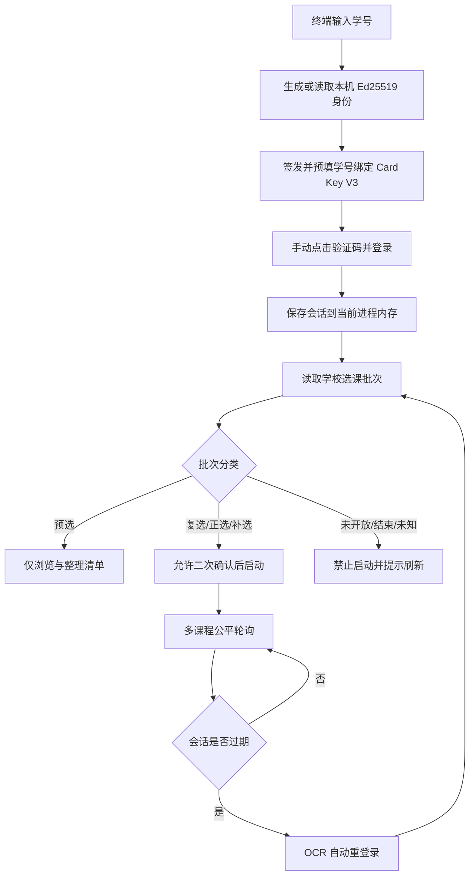

<div align="center">
  

# SZU Course Help

**深大抢课助手 · 本地 WebUI · 手动首登 · OCR 自动重登 · Card Key V3**

[](https://github.com/Weeye-hua/SZU-Course-Help/actions/workflows/ci.yml)


[](LICENSE)

面向深圳大学本科选课系统的本地辅助工具，用于登录、按校区浏览课程、维护待处理清单、查看已选课程与周课表，并在学校允许的复选、正选或补选阶段执行受保护的自动选课任务。

作者：[Weeye](https://github.com/Weeye-hua) · Misakait
</div>

> [!IMPORTANT]
> 预选阶段由学校抽签，本项目会禁止启动自动抢课。批次未知、未开放、已结束或无法向学校确认时同样禁止启动。请遵守学校规定并自行承担使用责任。


## 无需 Python：直接下载 Release

若您使用Linux，建议直接 [源码运行](#源码运行) 以取得更好的使用体验(部分Linux发行版可能无法正常运行打包程序)。

不熟悉 Python、Conda 或命令行的用户，请直接前往 **[Releases 下载页面](https://github.com/Weeye-hua/SZU-Course-Help/releases/latest)**，下载与系统匹配的压缩包。发布包已经包含程序、OCR 依赖、Markdown/PDF 使用手册和平台启动脚本，完整解压后即可运行。

- Windows 10/11 x64：双击 `启动抢课助手.bat` 或 `SZU-Course-Help.exe`。
- macOS Apple 芯片：下载 `macos-arm64`，双击 `启动抢课助手.command`。
- macOS Intel：下载 `macos-x64`，双击 `启动抢课助手.command`。
- Linux x64：运行 `启动抢课助手.sh`。

启动时先在终端输入学号，程序会生成并显示与本机身份绑定的 Card Key；输入 `Y` 后自动启动本地服务并打开登录页。首次学校登录仍由用户输入密码并手动完成点击验证码。详细步骤见 [Markdown 使用手册](docs/USER_GUIDE.md) 和 [PDF 使用手册](output/pdf/SZU-Course-Help-User-Guide.pdf)。

### v3.6.3 Release 更新

- 完成 Issue #9 的自动重登录收尾：学校登录提交只携带本轮验证码下发的 `route` 与 `insert_cookie`，不再拼接内存中已经过期的学校会话 Cookie。
- 验证码 token、图片和登录提交形成同一轮干净 Cookie 契约，避免重复 Cookie 名让学校端读取到旧 `route` 或 `JSESSIONID`。
- 验证码接口连续第 3 次返回结构性异常时会明确终止本轮自动恢复；取得一次完整响应即清零该计数，普通 OCR 识别失败仍保留最多 50 张验证码的预算。
- WebVPN 省略学校会话 Cookie 时只保留网关认证 Cookie；自动选课提交、课程字段、会话锁和 2000 次未知响应保护均未改变。
- 审查、补强并合入 [PR #12](https://github.com/Weeye-hua/SZU-Course-Help/pull/12)，新增登录请求头和连续异常边界回归测试。

### v3.6.2 Release 更新

- 修复自动重新登录获取验证码时继承过期 Cookie 的回归；验证码 token 和图片请求现在完全省略 `Cookie` 请求头，学校可重新下发有效路由 Cookie。
- 修复 Linux 打包版启动及“学校原始页面”无法拉起浏览器的问题；程序会识别 Nuitka 编译态，并从外部子进程环境中移除 OpenCV 导入产生的空库路径和发布目录条目，避免捆绑 OpenSSL 遮蔽系统库。
- Linux 使用无 shell 的 `xdg-open`/`gio open` 安全回退，WebVPN 受控浏览器同样使用隔离环境；Windows 与 macOS 行为保持不变。
- “学校原始页面”改为浏览器真实链接，并为 Linux Release 增加真实构建产物的子进程环境冒烟测试。
- 单门课程连续无法识别学校返回的保护性暂停阈值由 200 次提高到 2000 次；任意一次可识别响应仍会立即清零该课程计数。

### v3.6.1 Release 更新

- 爆发模式转一般模式、一般模式转扫描模式的业务失败阈值均可独立填写，范围为 1 至 1,000,000 次。
- 两个阈值都可单独选择“无限次”；启用后，该模式不会因业务失败自动降级。
- 默认行为仍为爆发模式失败 5 次转一般模式、一般模式累计失败 10 次转扫描模式；网络异常与学校 5xx 响应不计入业务失败。
- 设置在当前程序运行期间即时生效，页面状态提示会同步显示实际阈值。

### v3.6.0 Release 更新

- Release 数据改存系统用户目录，首次启动安全迁移旧版清单、Card Key 身份和账号隔离课程缓存，升级不再依赖旧解压目录。
- 安全暂停后可新增、移除、重试、开关和调整课程优先级；继续前与每轮请求前动态对账 SQLite，并支持明确停止整个任务。
- 修复新课程排名均为零导致上下移动无效、重复加入重置终态、失败重试状态不一致及多页面清单不同步等问题。
- 新增已选、待选与合计学分统计；保留只读课表、冲突时段提示、多校区目录和完整课程搜索。
- WebVPN 仅用于认证后的只读查询回退；选课提交固定走学校主站，本版不提供自动退课，也绝不替换已选课程。
- OCR 自动重登录兼容 `ddddocr 1.6.1` 多种 API，并由 Python 3.13/3.14 CI 和四平台 Release 构建真实初始化验证。
- 移除浏览器密码保存、磁盘会话恢复、同源学校反向代理、POST 故障切换、自动退课升级和强制包镜像。
- 经安全审查后重写整合 PR #7 的可用子集，并完成 Issue #6 与 #8；离线测试不会连接学校系统。

完整版本记录见 [CHANGELOG.md](CHANGELOG.md)。

> [!NOTE]
> 发布程序目前未购买 Windows 或 Apple 商业代码签名证书，系统可能显示未知开发者提示。请只从本仓库官方 Release 下载，不要运行群文件或网盘中的未知副本。

## 功能概览

| 能力 | 说明 |
| --- | --- |
| 本地 WebUI | FastAPI 仅监听 `127.0.0.1`，提供登录页、课程目录、清单和进度界面 |
| 本地单用户程序 | 只面向本机单用户使用；不考虑用户主动暴露到局域网或公网后造成的个人信息泄露风险 |
| 手动首次登录 | 终端签发学号绑定 Card Key，登录页输入学校密码并按提示点击四字验证码 |
| OCR 自动重登 | 会话过期后自动获取新验证码、识别坐标并恢复 token、Cookie 与批次 |
| 可见会话恢复 | 工作台显示自动重登录进行中、成功或失败；成功后自动继续原任务 |
| 多校区目录 | 支持粤海、丽湖、深大附属医院、技术大学、香港和深理光明校区；清单逐门保存校区 |
| 账号隔离缓存 | 完整目录缓存按学号摘要、批次和校区隔离，非开放期可显式只读查看 |
| 只读周课表 | 将已选课程按周一至周日、1 至 14 节排入网格，未排时间课程单独列出 |
| 学分汇总 | 分别显示学校已选、清单待选与合计学分，不据此自动退课 |
| 保守阶段门控 | 预选、未开放、已结束、未知批次和批次刷新失败均禁止自动抢课 |
| 多课程公平轮询 | 每轮对每门活动课程提交一次，避免单门课程长期阻塞其他课程 |
| 任务暂停与继续 | 清单中可随时暂停或继续，课程状态与尝试次数不会丢失 |
| 暂停后编辑清单 | 安全暂停后可增删、重试、开关及调整优先级；继续时动态同步后台队列 |
| 安全停止 | 可停止当前后台任务并保留本地清单和已记录进度 |
| 冲突保护 | 前端与购物车接口同时阻止已选或时间冲突教学班加入清单 |
| 中断恢复 | SQLite 保存本地清单，异常退出遗留的 `ENROLLING` 会恢复为 `PENDING` |
| 可恢复错误界面 | 区分非开放期、无有效批次、网络失败、超时、异常响应和登录过期 |
| Card Key V3 | 使用本机 Ed25519 身份签发学号绑定卡密，不再使用源码内置通用主密钥 |
| 离线安全测试 | Pytest 会拦截所有未模拟的外部 `requests` 请求，不会误触真实选课接口 |

## 源码运行

### 1. 获取源码

```powershell
git clone git@github.com:Weeye-hua/SZU-Course-Help.git
cd SZU-Course-Help
```

### 2. 准备环境

可以自行选择 Python 环境管理工具。若使用 [uv](https://docs.astral.sh/uv/)，项目不会强制修改你的包索引或镜像配置。

#### UV

```sh
uv sync
```

#### Conda

项目要求 Python 3.13。使用现有 Conda 环境：

```powershell
conda activate course
python -m pip install -r requirements.txt
```

也可以创建独立虚拟环境：

```powershell
python -m venv .venv
.\.venv\Scripts\Activate.ps1
python -m pip install -r requirements.txt
```

### 3. 启动

#### UV

```sh
uv run main.py
```

#### Conda / 其他 Python 环境

```powershell
python main.py
```

启动流程：

1. 在终端输入 6 至 12 位数字学号，程序生成并显示本机 Card Key V3。
2. 输入 `Y` 进入系统，浏览器打开本地登录页，例如 `http://127.0.0.1:8000/login`。
3. 登录页会预填学号和 Card Key；输入学校密码，按验证码顶部提示依次点击四个汉字。

服务默认使用 8000 端口。端口被占用时，程序会在后续端口中选择可用项。开发重载时，前端会保留当前页面并重新读取登录态。

## 工作原理



### 登录、批次与目录是独立状态

“登录成功”不代表学校当前开放选课，也不保证课程目录接口此刻可用。页面分别处理：

- **登录状态**：token 与 Cookie 是否仍然有效。
- **批次状态**：学校是否返回有效 `electiveBatch.code` 与 `typeName`。
- **课程目录状态**：具体课程接口是否成功返回可解析数据。

非开放期或没有有效批次时，前端不会继续请求课程目录，而是保留本地清单并显示“重新检查开放状态”。课程刷新遇到短暂网络错误时，如果同一页已有成功数据，页面会继续显示上次结果，不会突然清空。

## 阶段判断

阶段不按本地日期写死。后端登录后请求学校的 `student/{student_id}.do`，读取：

- `data.electiveBatch.code`：学校当前批次代码，提交时原样使用。
- `data.electiveBatch.typeName`：学校当前批次名称，用于保守分类。

| 分类 | 识别条件 | 自动抢课 |
| --- | --- | --- |
| `preselection` | 名称包含“预选” | 禁止 |
| `automatic` | 名称包含“复选”“正选”“补选”或“补退选” | 允许二次确认后启动 |
| `closed` | 包含“未开放”“不开放”“未开始”“暂停”“关闭”“结束”“截止”“停选”或“维护” | 禁止 |
| `unknown` | 空值或未识别名称 | 禁止 |

关闭关键词拥有最高优先级，所以“补选已结束”“复选未开始”不会因为同时包含允许关键词而误判为开放。

点击“确认启动”后，后端还会向学校重新刷新一次批次。刷新失败、批次缺失、登录状态在请求期间变化或当前阶段不在白名单时，后台任务都不会创建。

## 课程目录

| 页面目录 | 学校类型 | 状态 |
| --- | --- | --- |
| 本班推荐 | `TJKC` | 使用专用 `elective/recommendedCourse.do` |
| 方案内课程 | `FANKC` | 支持 |
| 方案外课程 | `FAWKC` | 支持 |
| 校公选课 | `XGXK` | 支持 |
| 体育课程 | `TYKC` | 支持 |
| 慕课 | `MOOC` | 支持 |
| 辅修课程 | `FXKC` | 当前明确禁用 |

WebUI 页码从 1 开始，后端转换为学校接口需要的 0 起始页码。学校目录接口固定每页 10 门课程。

前端不会因为课程组被标记为 `selected` 就隐藏整个课程；每个教学班会根据 `is_choose`、`is_conflict` 和 `is_full` 独立展示。已选或冲突教学班无法加入清单，满员但不冲突的教学班可加入候补清单。

课程工具栏可以切换学校当前提供的六个校区。首次登录优先采用学校返回的学生默认校区；之后手动切换不会被批次刷新或 OCR 自动重登录覆盖。目录缓存按学号、批次和校区隔离。每门加入清单的课程会独立保存校区代码，因此切换到其他校区继续浏览，不会改变已经在清单中的课程提交参数。旧版数据库中的清单会兼容迁移为粤海校区。

课程工具栏的“缓存模式”会先读取最近一次成功且非空的课程列表；已登录时每 30 秒发起一次明确的实时刷新，失败或空响应不会清空缓存视图。`TJKC`（本班推荐）和 `FANKC`（方案内课程）会在完整读取后持久化全目录；未登录、无批次或非开放期只进行缓存读取，不会把 `cache_mode=true` 偷偷回退为学校网络请求。缓存按终端预填学号的不可逆摘要、批次和校区匹配，不会回退使用其他账号数据，且缓存课程不能直接加入清单。

本软件是本地单用户程序，默认仅监听 `127.0.0.1`。安全边界不包含用户主动修改监听地址、端口转发或反向代理，将服务暴露到局域网或公网后造成的个人信息泄露风险；请勿以此方式公开服务。

## 我的课表

“查看课表”只读取学校系统的当前已选课程，不调用选课、退课或清单修改接口。程序会从学校时间地点字段中逐段提取“星期 + `1-14` 节”的组合；同一课程通过逗号、分号、换行或 `<br>` 连接的多个排课段会分别放入对应位置。周次范围以及单双周只作为卡片信息展示，不影响课程进入课表。只有无法提取具体星期与节次，或节次超出范围的课程才会保留在网格下方。

课表只在实际重叠的课程之间分栏，不会因为同一天其他时段存在重叠而压缩全部课程。网格行高会依据课程名称、周次、地点与教师信息自动增大，较长内容会完整换行显示。

## 自动选课行为

- 每轮对每门活动课程各提交一次，避免一门课独占循环。
- 成功后立即标记 `SUCCESS` 并停止该课程，其余课程继续。
- 容量已满属于正常可重试状态，课程持续保留在活动集，不受“20 次”或未知返回阈值限制。
- 已选、时间冲突、超过学分等明确且重试无效的错误才会标记为 `FAILED`。
- 批次名称可能是“正选”，但学校的实际开放时段仍可能尚未开始。收到明确的未开放响应后，任务只请求一次便自动暂停，开放后可手动继续。
- 连续未知响应或连续网络异常达到保护阈值后暂停整个任务并保留课程，避免接口变化造成无限请求；不会把课程永久写成失败。
- 清单进度区可以暂停或继续；暂停会在当前学校请求结束后生效，继续前会重新向学校确认批次仍允许自动选课。
- 页面显示“已暂停”后可以增删、重试、开关课程和调整组内优先级；恢复边界及每轮请求前都会重新读取本地数据库。
- “停止抢课”会有序结束后台任务并保留清单；再次启动前仍需重新确认学校阶段。
- 优选分组和优先级只控制每轮尝试顺序，不会触发退课、换课或自动升级。
- 后台任务独立于 HTTP 请求运行，长时间暂停不会占住页面请求，关闭程序后下次启动会恢复中断课程为待处理。
- 同时只允许一个后台任务；运行且尚未安全暂停时清单锁定，也不能退出登录。
- 状态流转为 `PENDING -> ENROLLING -> SUCCESS/FAILED`。

学校选课提交 URL、字段和 `addParam` 格式保持原协议，并由固定契约测试保护。

## OCR 自动重登录

首次登录始终由用户手动完成。只有学校会话过期后，程序才执行 OCR 恢复：

1. 使用当前进程内存中的学号和密码获取新 `vtoken`。
2. 下载点击验证码并校验内容类型、JPEG 文件头、Cookie、尺寸和 2 MiB 上限。
3. 分离顶部目标文字区与底部候选文字区。
4. 使用 `ddddocr` 识别候选字符及边界框；可选 PaddleOCR 识别顶部四字提示。
5. 按目标顺序做不重复匹配，计算四个边界框中心坐标。
6. 重新生成学校要求的 `loginPwd` 并调用登录接口。
7. 原子更新 token、Cookie 与批次，后台任务从未完成课程继续。

每次自动重登录最多尝试 **50** 张验证码，失败间隔会渐进增加但不超过 1 秒。多个请求同时发现过期时，只允许一个 OCR 恢复流程运行，其他请求复用恢复后的会话；保活只在后台任务活动时运行，且不会与 OCR 恢复并行改写会话。

工作台会持续显示“正在自动重新登录”。恢复成功后无需刷新页面，课程数据与未完成抢课任务会自动继续；连续恢复失败时任务暂停，完成手动登录后可返回清单点击“继续任务”。网页状态中不会包含密码、Cookie、token 或验证码内容。

可选 PaddleOCR 回退默认关闭：

```powershell
$env:COURSE_SELECT_USE_PADDLE_OCR = "1"
python main.py
```

## 密码学与敏感数据

项目中有两套用途完全不同的机制。

### 学校 `loginPwd` 协议

学校登录接口要求兼容其旧版前端协议。`school_password.encrypt_school_password()` 使用移植自 `des.js` 的固定 DES 变换和学校 Base64 规则生成线协议字段。这不是本地密码存储方案，也不能擅自替换为 AES 或哈希，否则学校服务器无法识别。

学校密码只保存在当前 Python 进程内存中，用于会话过期后的自动恢复；注销、退出或开发重载后清除，不写入 SQLite、浏览器存储或任何会话文件。`/api/session/recover` 也拒绝接收浏览器重新提交的密码。

### Card Key V3

Card Key V3 使用 Ed25519 数字签名：

- 令牌格式为 `SZU3.<规范化JSON>.<Ed25519签名>`。
- 载荷包含版本、学号、签发时间、随机 nonce 与公钥指纹。
- Card Key 与当前安装生成的密钥身份绑定，更换密钥会使旧卡密失效。
- 学号不是秘密；签名目标是防篡改和真实性验证，而不是隐藏学号。
- Card Key 只在本地校验，不会发送给学校。

> [!CAUTION]
> `card_signing_private.pem` 是签发权限，绝不能提交到 Git、上传网盘或发给他人。仓库已忽略所有 `*.pem` 和 `*.key`，但推送前仍应检查暂存区。

可通过环境变量加密私钥文件：

```powershell
$env:COURSE_SELECT_KEY_PASSPHRASE = "你的本机私钥口令"
python main.py
```

## 配置

可复制 `.env.example` 了解支持的环境变量。程序不会自动读取 `.env` 文件，应在终端或系统环境中设置。

| 环境变量 | 默认值 | 作用 |
| --- | --- | --- |
| `COURSE_SELECT_DATA_DIR` | 源码目录；Release 为系统用户数据目录 | 清单、课程缓存等可写数据目录 |
| `COURSE_SELECT_DB_PATH` | 数据目录下 `course_enroll.db` | 本地清单数据库路径 |
| `COURSE_SELECT_KEY_DIR` | 源码目录；Release 为数据目录下 `keys` | Card Key 密钥目录 |
| `COURSE_SELECT_LEGACY_DATA_DIR` | 自动发现 | 多个旧 Release 并存时明确指定迁移来源 |
| `COURSE_SELECT_KEY_PASSPHRASE` | 空 | 加密 Ed25519 私钥 |
| `COURSE_SELECT_PORT` | `8000` | 本地 WebUI 首选端口 |
| `COURSE_SELECT_UNKNOWN_RESPONSE_LIMIT` | `2000` | 单门课连续未知响应的保护性暂停阈值 |
| `COURSE_SELECT_CATALOG_PAGE_DELAY_MS` | `600` | 完整目录相邻学校请求的最小间隔（毫秒） |
| `COURSE_SELECT_CATALOG_THROTTLE_RETRIES` | `3` | 学校明确限流时的有限重试上限 |
| `COURSE_SELECT_CATALOG_THROTTLE_BACKOFF_MS` | `2000` | 首次限流退避时间（毫秒） |
| `COURSE_SELECT_CATALOG_CACHE_TTL_SECONDS` | `21600` | 课程缓存的新鲜期限（秒） |
| `COURSE_SELECT_DEV` | `0` | 开发模式后端自动重载；修改 Python/API 后自动重启服务 |
| `COURSE_SELECT_USE_PADDLE_OCR` | `0` | 启用 PaddleOCR 顶部文字回退 |
| `COURSE_SELECT_NO_BROWSER` | `0` | 启动时不自动打开浏览器 |
| `COURSE_SELECT_BROWSER` | 自动发现 | WebVPN 只读认证使用的 Chromium/Chrome/Edge 路径 |

### Release 数据目录与迁移

- Windows：`%APPDATA%\SZU-Course-Help\`
- macOS：`~/Library/Application Support/SZU-Course-Help/`
- Linux：`${XDG_DATA_HOME:-~/.local/share}/SZU-Course-Help/`

打包版首次使用新目录时，会在当前安装目录和同级旧版文件夹中寻找 `course_enroll.db`、Ed25519 公私钥及安全的 v2 课程缓存。迁移使用 SQLite backup API 包含 WAL 内容，校验数据库完整性和密钥配对，只复制、不移动、绝不覆盖目标文件。发现多个候选目录时由终端选择；非交互启动会拒绝猜测，可用 `COURSE_SELECT_LEGACY_DATA_DIR` 明确指定。源码模式仍默认把数据留在源码目录，环境变量始终拥有最高优先级。

## 项目结构

```text
SZU-Course-Help/
├─ main.py                    # 终端入口、Card Key 签发、WebUI 启动
├─ app.py                     # FastAPI 路由、阶段门控、静态资源
├─ campus.py                  # 学校校区代码、名称与统一校验
├─ logic.py                   # 学校登录、批次、验证码与 OCR
├─ choose_course.py           # 已选课程查询与选课提交协议
├─ course_list.py             # 课程目录请求
├─ course_models.py           # 学校响应模型与前端投影
├─ school_password.py         # 学校 loginPwd 协议入口
├─ school_session.py          # 统一会话过期识别
├─ database.py                # SQLite 清单与中断恢复
├─ services/                  # 认证、迁移、缓存、课表、清单、会话与后台任务
├─ security/key_manager.py    # Ed25519 Card Key V3
├─ static_dist/               # 登录页与课程工作台
├─ tests/                     # 离线测试、夹具与假数据 UI 预览
└─ .github/workflows/ci.yml   # GitHub Actions
```

## 开发与验证

```powershell
conda activate course
python -m pip install -e ".[test]"

python -m ruff check .
python -m ruff format --check .
python -m compileall -q .
python -m pytest -q
node --check static_dist/login.js
node --check static_dist/course-app.js
```

测试覆盖学校密码固定向量、Card Key 签发与篡改、Cookie 解析、OCR 重试、并发会话恢复、批次分类、校区切换与持久化、课表解析、课程接口契约、`TJKC` 专用端点、冲突拦截、购物车恢复、结果分类和异常提示。

`tests/conftest.py` 会拦截所有未模拟的外部 HTTP 请求，因此自动测试不会连接深圳大学系统或提交选课。

### 假数据 UI 预览

```powershell
python tests/ui_preview_server.py
# http://127.0.0.1:8001/
```

### 后端开发自动重载

开发 API 时设置 `COURSE_SELECT_DEV=1`：

```powershell
$env:COURSE_SELECT_DEV = "1"
$env:COURSE_SELECT_DATA_DIR = "./runtime-data"
python main.py
```

Uvicorn 会监视项目 Python 源码；修改后端代码后自动重启服务。重载会清空只存在内存中的学校密码、token 与 Cookie，因此需要重新手动完成验证码登录。这是敏感数据不落盘的预期行为。

可以切换预览状态：

```powershell
$env:COURSE_SELECT_PREVIEW_PHASE = "closed"      # 非开放期
$env:COURSE_SELECT_PREVIEW_PHASE = "unknown"     # 无有效批次
$env:COURSE_SELECT_PREVIEW_PHASE = "automatic"   # 补选阶段
$env:COURSE_SELECT_PREVIEW_LOGGED_OUT = "1"
$env:COURSE_SELECT_PREVIEW_CAPTCHA = "unavailable" # 验证码接口未开放
python tests/ui_preview_server.py
```

预览服务的课程、登录态和批次刷新均为本地假数据，不会请求学校系统。

## 打包

源码验证完成后可使用 Nuitka：

```powershell
python -m pip install -e ".[build]"
.\build.bat
```

输出位于 `build/CourseEnroll/`。签名密钥、数据库、课程缓存和日志不会嵌入打包结果；正式 Release 在首次运行时使用平台用户数据目录，并可安全迁移旧解压目录中的本地身份和清单。

## 常见问题

### 登录成功后为什么显示“暂未读取到选课批次”？

登录接口成功，但学校没有返回有效批次。通常是选课尚未开放、批次切换或学校服务短暂波动。点击“重新检查开放状态”即可，本地清单不会丢失。

### 为什么登录页显示“当前时段暂无验证码”？

学校在预选、复选、正选、补选或补退选以外的时段，可能直接关闭登录验证码接口。程序会停止本次加载、禁用登录按钮并保留“重新获取验证码”按钮；等待学校开放或维护结束后再手动重试即可。该状态不表示密码或 Card Key 错误。

### 为什么非开放期看不到课程？

学校在非开放期可能拒绝课程目录请求。程序会在已知 `closed` 或没有批次代码时提前停止请求，并给出状态提示，避免把正常的“未开放”误报为登录失败。

### 为什么显示“正选”却在启动后自动暂停？

“正选”是学校返回的批次名称，不一定代表当前分钟已进入该批次的实际开放时段。程序不会用本地写死日期猜测开放时间；第一次提交若收到“当前时间不在选课开放时间范围内”，会立即暂停且不再重复请求。等学校正式开放后，在选课清单中点击“继续任务”即可。

### 正式开放后抢不到，会不会尝试 20 次就停止？

不会。课程满员是明确的可重试状态，会持续轮询，直到抢到、出现不可恢复错误、你手动暂停，或遇到连续网络异常或连续 2000 次未知响应而触发保护性暂停。未知计数按课程分别维护，只统计连续未知响应；中间只要收到一次可识别结果就会清零。需要自定义时可在启动前设置 `COURSE_SELECT_UNKNOWN_RESPONSE_LIMIT`，但不建议取消保护。

### 为什么刷新失败后课程没有消失？

同一目录和页码已有一次成功结果时，网络或学校接口的短暂失败只会提示刷新失败，页面继续展示上次成功数据。切换目录或页码时不会混用旧数据。

### 为什么辅修课程不可用？

部分学生访问 `FXKC` 会被学校接口拒绝。当前版本显式禁用该类别，避免展示不可靠结果。

### 为什么课程没有出现在课表网格里？

只要学校返回的数据中包含可对应的星期与 `1-14` 节具体节次，课程就会进入网格；同一课程的多个星期、多个时段、不同周次以及单双周都会分别展示。只有没有具体节次、缺少星期，或节次超出范围时，课程才会显示在课表下方的“未提供可排入课表的具体时间”列表中，原始时间地点仍会保留供核对。

### 为什么自动重登录提示“OCR 依赖不可用”？

请先升级到 v3.6.0 或更新版本；该版本兼容 `ddddocr 1.6.1` 的 `ddddocr.core`、顶层新引擎与旧 `DdddOcr` 三种布局，并在 Python 3.13/3.14 CI 及各平台 Release 构建前真实初始化 OCR。请重新安装 `requirements.txt`，不要复用依赖不明的虚拟环境。

### 为什么升级后仍然没有找到旧清单？

新 Release 会保守扫描当前安装目录及同级、名称匹配的旧版目录。若存在多个候选，它不会猜测来源，请按终端提示选择；也可在启动前设置 `COURSE_SELECT_LEGACY_DATA_DIR`。目标已有数据库或密钥时绝不覆盖。旧目录不会被删除，可以确认新版本数据无误后自行处理。

### WebVPN 会用于自动选课吗？

不会。WebVPN 认证只为只读课程与已选信息查询提供备用入口；选课提交固定发送到学校主站且不跨后端重试，本版不提供自动退课。受控浏览器使用一次性临时配置，关闭后清理，不保存学校密码。

### 切换校区会影响已经加入清单的课程吗？

不会。校区切换只改变后续课程目录查询；每门清单课程保存加入时的校区代码，后台提交继续使用该课程自己的校区。OCR 自动重登录和批次刷新也不会重置手动选择的校区。

### 为什么旧 Card Key 无法使用？

V3 已弃用旧版固定主密钥方案。Card Key 还与当前安装的 Ed25519 公钥指纹绑定；丢失或更换密钥后需要重新签发。

### 页面还是旧 UI 怎么办？

确认终端启动的是当前源码目录的 `python main.py`，并使用本次终端打印的普通 `/login` 地址。静态资源通过构建版本号刷新；若仍缓存旧资源，请关闭旧页面后重新打开该地址。开发重载不会恢复学校密码或会话。

## 贡献与安全

- 贡献规范见 [CONTRIBUTING.md](CONTRIBUTING.md)。
- 敏感数据与漏洞报告说明见 [SECURITY.md](SECURITY.md)。
- 提交 Issue 前请先脱敏，不要公开学号、密码、Cookie、token、验证码或 Card Key。

## 免责声明与许可证

本项目是非官方工具，与深圳大学及其选课系统运营方无隶属或授权关系。学校接口、规则和页面可能随时变化。使用者应遵守学校规章、适用法律和上游系统限制，并自行承担账号、选课结果与系统风控风险。

项目采用 [MIT License](LICENSE) 发布。许可证允许使用、复制、修改、合并、发布和分发，但软件按“原样”提供，不附带任何明示或默示担保。学校系统使用规则与适用法律仍独立约束每位使用者。
